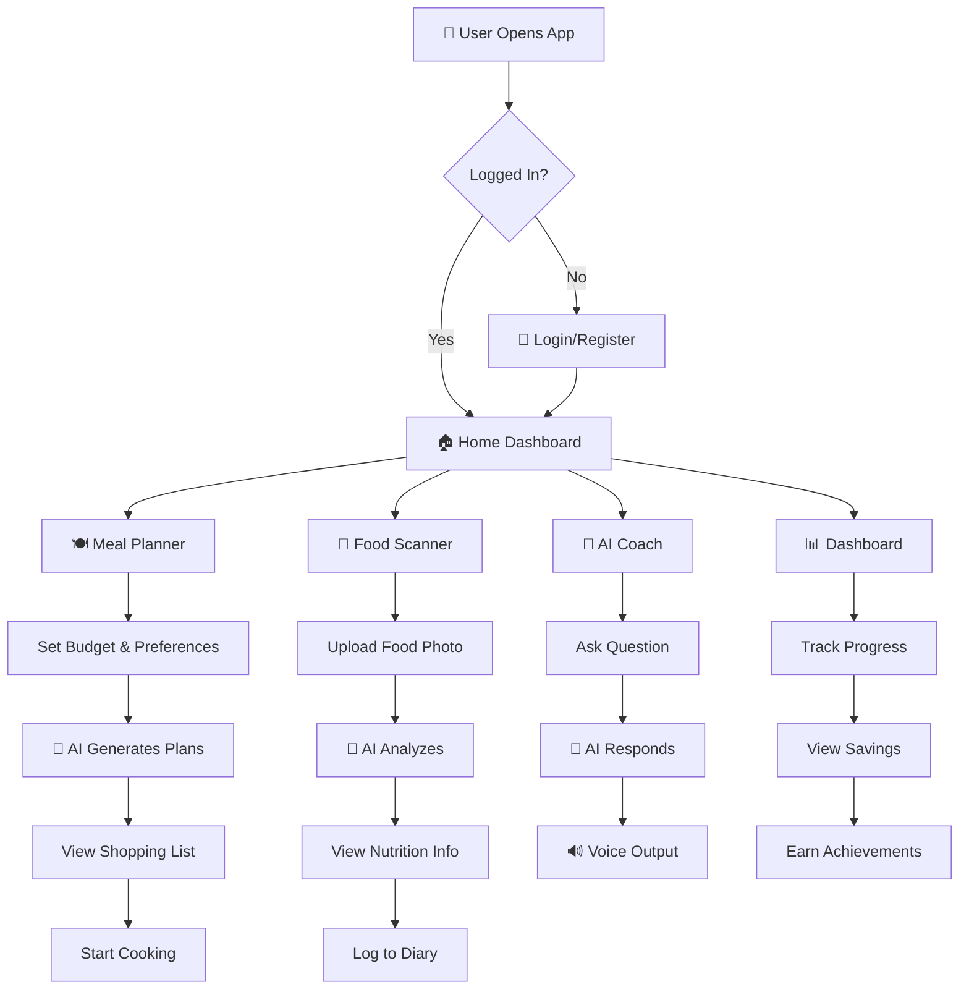

# 🍳 Cook Healthy AI

<div align="center">


**AI-Powered Budget Meal Planning & Wellness Platform**

[](https://nextjs.org/)
[](https://www.typescriptlang.org/)
[](https://ai.google.dev/)
[](https://tailwindcss.com/)

[📖 Features](#-features) • [🏗️ Architecture](#️-architecture) • [🚀 Installation](#-installation) • [🤝 Contributing](#-contributing)

</div>


---

## 🌟 Overview

**Cook Healthy AI** is a revolutionary AI-powered platform that helps users plan nutritious, budget-friendly meals while promoting healthy eating habits. Built with cutting-edge technologies including Google Gemini AI for intelligent meal suggestions and ElevenLabs for voice interactions.

### 🎯 Problem Statement

- **Rising Food Costs**: Households struggle to eat healthy on a budget
- **Lack of Nutrition Knowledge**: People don't know what to cook for their health goals
- **Food Waste**: 30% of food purchased goes to waste
- **Time Constraints**: Busy lifestyles make meal planning difficult

### 💡 Our Solution

An AI-first approach that starts with your **budget and available ingredients**, not recipes. The platform intelligently generates meal plans that maximize nutrition while minimizing cost and food waste.

---

## ✨ Features

### 🤖 AI-Powered Core Features

| Feature | Description |
|---------|-------------|
| **🧠 Smart Meal Planner** | Budget-first AI meal planning with multiple plan alternatives |
| **📸 Food Scanner** | Upload food photos for instant AI nutrition analysis |
| **💬 AI Wellness Coach** | Conversational AI for personalized nutrition advice |
| **🗣️ Voice Assistant** | ElevenLabs-powered voice input/output for hands-free cooking |

### 📱 Platform Features

- **📊 Impact Dashboard** - Track health score, savings, and environmental impact
- **🛒 Smart Shopping List** - AI-optimized shopping with store recommendations
- **👥 Community** - Share recipes, challenges, and leaderboards
- **🏆 Achievements** - Gamified experience with streaks and badges
- **🥗 Recipe Library** - International cuisine with detailed instructions
- **🏥 Health Programs** - Specialized programs for diabetes, heart health, etc.
- **🏪 Local Stores** - Find ingredients at nearby stores with price comparison

---

## 🏗️ Architecture

```
┌─────────────────────────────────────────────────────────────────┐
│                        COOK HEALTHY AI                          │
├─────────────────────────────────────────────────────────────────┤
│                                                                 │
│  ┌──────────────┐   ┌──────────────┐   ┌──────────────┐        │
│  │   Frontend   │   │   AI Layer   │   │   Backend    │        │
│  │   (Next.js)  │◄──►│  (Gemini)   │◄──►│  (Supabase) │        │
│  └──────────────┘   └──────────────┘   └──────────────┘        │
│         │                  │                   │                │
│         ▼                  ▼                   ▼                │
│  ┌──────────────┐   ┌──────────────┐   ┌──────────────┐        │
│  │ React/TSX    │   │ Gemini 2.0   │   │ PostgreSQL   │        │
│  │ Tailwind CSS │   │ Flash Model  │   │ Auth/RLS     │        │
│  │ Framer Motion│   │ Vision API   │   │ Storage      │        │
│  └──────────────┘   └──────────────┘   └──────────────┘        │
│         │                                      │                │
│         ▼                                      ▼                │
│  ┌──────────────┐                     ┌──────────────┐         │
│  │ ElevenLabs   │                     │  User Data    │         │
│  │ Voice TTS    │                     │  Meal Plans   │         │
│  │ Speech API   │                     │  Preferences  │         │
│  └──────────────┘                     └──────────────┘         │
│                                                                 │
└─────────────────────────────────────────────────────────────────┘
```

### Tech Stack

| Layer | Technology |
|-------|------------|
| **Frontend** | Next.js 16, React 19, TypeScript 5 |
| **Styling** | Tailwind CSS 3.4, Framer Motion |
| **AI/ML** | Google Gemini 2.0 Flash (text + vision) |
| **Voice** | ElevenLabs Text-to-Speech |
| **Backend** | Supabase (PostgreSQL, Auth, Storage) |
| **State** | React Hooks, Context API |
| **Charts** | Recharts |

---

## 🔄 User Flow



---

## 🚀 Installation

### Prerequisites

- Node.js 18+ 
- npm or yarn
- Google Gemini API key
- (Optional) ElevenLabs API key
- (Optional) Supabase project

### Quick Start

```bash
# Clone the repository
git clone https://github.com/yourusername/cook-healthy-ai.git
cd cook-healthy-ai

# Install dependencies
npm install

# Set up environment variables
cp .env.example .env.local
# Edit .env.local with your API keys

# Run development server
npm run dev
```

### Environment Variables

Create a `.env.local` file in the root directory:

```env
# Required - Gemini AI
NEXT_PUBLIC_GEMINI_API_KEY=your_gemini_api_key

# Optional - Voice Features
NEXT_PUBLIC_ELEVENLABS_API_KEY=your_elevenlabs_key

# Optional - Database & Auth
NEXT_PUBLIC_SUPABASE_URL=your_supabase_url
NEXT_PUBLIC_SUPABASE_ANON_KEY=your_supabase_anon_key
```

### Get API Keys

| Service | Link | Purpose |
|---------|------|---------|
| Gemini AI | [aistudio.google.com](https://aistudio.google.com/app/apikey) | Core AI features |
| ElevenLabs | [elevenlabs.io](https://elevenlabs.io/) | Voice TTS (optional) |
| Supabase | [supabase.com](https://supabase.com/) | Auth & DB (optional) |

---

## 📁 Project Structure

```
cook-healthy-ai/
├── src/
│   ├── app/                    # Next.js App Router pages
│   │   ├── page.tsx           # Home page
│   │   ├── coach/             # AI Wellness Coach
│   │   ├── food-scan/         # Food Scanner
│   │   ├── meal-planner/      # AI Meal Planner
│   │   ├── dashboard/         # Impact Dashboard
│   │   ├── community/         # Social features
│   │   ├── shopping-list/     # Smart Shopping
│   │   └── ...
│   ├── components/            # Reusable UI components
│   │   ├── ui/               # Base UI components
│   │   ├── Navigation.tsx
│   │   ├── RecipeCard.tsx
│   │   └── ...
│   ├── lib/                   # Core logic & integrations
│   │   ├── gemini/           # Gemini AI modules
│   │   │   ├── client.ts     # Gemini client
│   │   │   ├── foodScanner.ts
│   │   │   ├── mealPlanGenerator.ts
│   │   │   └── wellnessCoach.ts
│   │   ├── elevenlabs/       # Voice integration
│   │   └── supabase/         # Database & auth
│   ├── data/                  # Mock data & helpers
│   ├── types/                 # TypeScript types
│   └── utils/                 # Utility functions
├── public/                    # Static assets
│   └── images/               # Food images
├── .env.example              # Environment template
├── tailwind.config.ts        # Tailwind configuration
└── package.json
```

---

## 🔮 AI Features Deep Dive

### 1. Budget-First Meal Planning

The AI meal planner uses a unique **budget-first** approach:

```
User Inputs → AI Processing → Output
─────────────────────────────────────
Budget: $100/week
People: 4
Diet: Vegetarian
Equipment: Stove, Microwave
Skill: Beginner
                    ↓
            ┌─────────────────┐
            │   Gemini AI     │
            │  Budget-First   │
            │   Algorithm     │
            └─────────────────┘
                    ↓
• 2-3 Weekly Plan Alternatives
• Shopping List with Costs
• Nutrition Highlights
• Waste Reduction Tips
• Cost Savings Estimate
```

### 2. Food Photo Analysis

Upload any food photo for instant AI analysis:
- **Dish Recognition** with confidence score
- **Nutrition Facts** (calories, protein, carbs, fat, fiber)
- **Ingredients Detection**
- **Health Rating** (1-10 scale)
- **Cost Comparison** (homemade vs restaurant)

### 3. Wellness Coach

Conversational AI for personalized nutrition advice:
- Diet recommendations
- Recipe suggestions
- Health goal tracking
- Budget meal ideas
- Voice input/output support

---

## 🛠️ Development

### Commands

```bash
# Development
npm run dev          # Start dev server

# Production
npm run build        # Build for production
npm run start        # Start production server

# Code Quality
npm run lint         # Run ESLint
npm run type-check   # TypeScript check
```

### Adding New AI Features

1. Create a new module in `src/lib/gemini/`
2. Import the Gemini client
3. Define prompts and response types
4. Add mock fallback for offline mode
5. Export functions for use in components

---

## 🤝 Contributing

We welcome contributions! Please see our [Contributing Guide](CONTRIBUTING.md) for details.

1. Fork the repository
2. Create a feature branch (`git checkout -b feature/amazing-feature`)
3. Commit changes (`git commit -m 'Add amazing feature'`)
4. Push to branch (`git push origin feature/amazing-feature`)
5. Open a Pull Request

---

## 📄 License

This project is licensed under the MIT License - see the [LICENSE](LICENSE) file for details.

---

## 🙏 Acknowledgments

- [Google Gemini AI](https://ai.google.dev/) - AI capabilities
- [ElevenLabs](https://elevenlabs.io/) - Voice synthesis
- [Supabase](https://supabase.com/) - Backend infrastructure
- [Vercel](https://vercel.com/) - Deployment platform
- [Lucide Icons](https://lucide.dev/) - Beautiful icons

---

<div align="center">

**Built with ❤️ for healthy eating on a budget**

[⬆ Back to Top](#-cook-healthy-ai)

</div>
